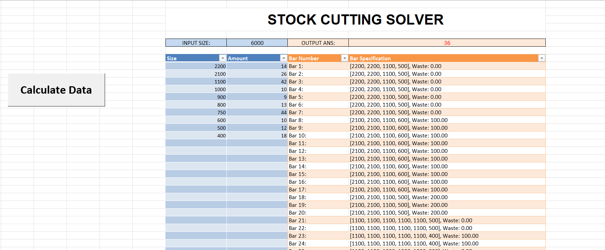

# StockCutter
Note: this is a modified and extended version of Surge Kurk's book. [The Book](https://www.amazon.com/Practical-Python-Projects-Mathematical-Tools/dp/1484234227/ref=as_li_ss_tl?ie=UTF8&linkCode=sl1&tag=&linkId=6519c73990b06456338ca6125fbf95c0) , [Repo code of the book](https://github.com/sgkruk/Apress-AI/)

StockCutter is an Excel-integrated tool that solves the stock cutting problem, optimizing material usage to minimize waste. It uses Python and xlwings to calculate the most efficient cutting patterns for given stock lengths and required cuts.

## Features
- 📊 Excel Integration – Uses xlwings to communicate between Excel and Python.

- 🧠 Optimization Algorithm – Calculates optimal cutting patterns to reduce waste.

- 🔄 Automated Processing – Updates Excel with results automatically.

- 🔧 Customizable Inputs – Users can adjust stock sizes, required cuts, and other parameters.

## Usage
1. Enter the stock length and required cuts in the excel sheet.
2. Enter the size of the stock the manufactorer provide.
3. Press the calculate button.
4. Wait for results.

## Project Preview

